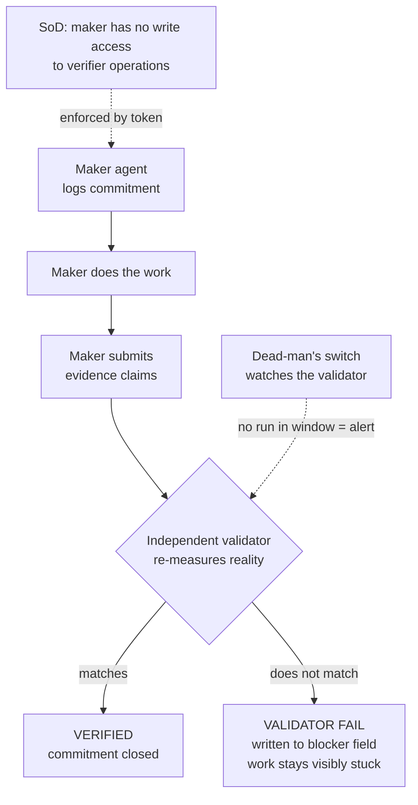

# Attestor

> An accountability and verification layer for AI agent fleets — so that **"done" means proven, not claimed.**

> [!NOTE]
> **Reference implementation, not a maintained product.** This is a clean extraction of a pattern that has run a live small-business agent fleet in production. It is published to be read, forked, and adapted — not supported. Licensed under Apache-2.0.

---

## For the business reader

If you run a team of AI agents — or are evaluating whether you should — the hardest operational question is: *did the work actually happen?*

Agents don't lie in the traditional sense. They pattern-match to what a *completed task* looks like and output that, whether or not the underlying work occurred. The transcript looks clean. The agent sounds confident. The file may not exist. The deploy may not have run. The commitment may never have started.

This is not a hallucination problem. It is a **control gap** — and it is the same control gap that financial auditors closed decades ago with maker-checker controls and independent substantive testing.

Attestor applies three principles from financial audit practice directly to AI agent operations:

- **Pre-authorization:** No commitment logged = work has not started. By definition. The ledger is the gate.
- **Evidence-based assurance:** Closing a task requires verifiable proof — not the agent's word, not a pasted log. Independently checked artifacts.
- **Maker-checker segregation:** The agent that did the work cannot be the one that verifies it. A separate, token-gated process re-measures the real world. The agent's transcript is not consulted.

If you have run an agent fleet and caught an agent posting "done ✓" for work it never started — this is the tooling that makes that state detectable by design, not by luck.

*Built by Scott Lindsay (internal audit, banking controls, SBR). Extracted from a live small-business agent fleet.*

---

## The problem

Agents fabricate. Not maliciously — they pattern-match to what a *successful completion* looks like and emit that output, whether or not the underlying work actually happened. They also forget between sessions, and an anonymous subagent spawned and discarded has no reputation to protect.

You cannot prompt this away. Telling an agent "don't fabricate" changes nothing, because the agent believes it isn't.

**Fabrication is an architecture problem, not a behavior problem.** The fix is not a better prompt — it is tooling that makes fabrication *detectable* and self-reported completion *unnecessary to trust.*

---

## What this is

A small, framework-agnostic enforcement layer that sits around any agent (or fleet of agents) and makes their work **accountable** and **independently verifiable**. Built from six primitives drawn directly from financial-controls practice:

| Primitive | Controls analogue | What it enforces |
|-----------|------------------|-----------------|
| **Commitments ledger** | Pre-authorization | Work is logged *before* it starts. No open commitment = the work hasn't started. |
| **Evidence-required completion** | Evidence-based assurance | Closing a commitment requires verifiable proof — file paths, HTTP responses, row counts. Words are not evidence. |
| **Independent validator** | Substantive testing | A separate process **re-measures reality** after an agent marks work done. It does not trust the agent's pasted evidence — it hits the endpoint, counts the rows, stats the file itself. |
| **Maker-checker gate** | Four-eyes / dual control | The agent that *did* the work cannot be the one that *verifies* it. Enforced by a verifier token never present in the maker's environment. |
| **Segregation of duties** | Least privilege / SoD | The audited party cannot write to the ledger it is judged against. Enforced at the permission layer — not the prompt. |
| **Validator dead-man's switch** | Monitor the monitor | If the validator stops reporting within its expected window, that is an alert. Silence is not success. |

---

## How it works



The load-bearing idea: **claimed evidence and verified evidence are separately sourced, and only the checker's independent measurement counts.** A fabricating agent can paste a plausible `200 OK` as easily as it fabricates the work — so the checker never reads the agent's transcript. It measures the world.

---

## Quickstart

```bash
git clone https://github.com/smallbusinessrisk/attestor
cd attestor
pip install -e .

# Set the verifier token — only in the validator's environment, never in maker context
export ATTESTOR_VERIFIER_TOKEN=$(python3 -c "import secrets; print(secrets.token_hex(32))")

# Run the fabrication demo — watch an agent get caught in real time
python examples/fabrication_demo/run_demo.py
```

---

## Usage

### Maker side (any agent doing work)

```python
from attestor.adapters.store.sqlite import SQLiteLedger
from attestor.core.maker import MakerAPI
from attestor.core.evidence import EvidenceClaim

ledger = SQLiteLedger("attestor.db")
maker = MakerAPI(ledger=ledger, maker_id="my-agent")

# 1. Log commitment before starting — no commitment = not started
commitment = maker.commit("Deploy updated server.js to production", due_hours=1)
maker.start(commitment.id)

# 2. Do the actual work
# ... deploy the file ...

# 3. Submit structured evidence claims for the validator to independently verify
maker.submit_evidence(commitment.id, [
    # HTTP: check endpoint returns expected status — validator hits it directly,
    # never reads the agent's pasted response
    EvidenceClaim(
        kind="http_status",
        description="/health returns 200 after deploy",
        url="https://myserver.example.com/health",
        expected_status=200,
    ),
    # File: prove the file was written and is non-trivially sized —
    # "file exists" without min_bytes catches empty/placeholder writes
    EvidenceClaim(
        kind="file_exists",
        description="server.js present and non-empty on disk",
        path="/var/www/app/server.js",
        min_bytes=5000,   # reject suspiciously small deploys
    ),
    # Git commit: verify the commit hash actually exists in repo history —
    # validator runs git cat-file -t directly, never trusts the agent's output
    EvidenceClaim(
        kind="git_commit",
        description="deploy commit recorded in git history",
        repo_path="/var/www/app",
        commit_hash="a3f8c1d",  # short hash is fine; full SHA-1 also accepted
    ),
    # Row count: confirm the DB write actually landed —
    # catches agents that claim success after a silent rollback
    EvidenceClaim(
        kind="row_count",
        description="deploy audit log row written to DB",
        db_path="/var/www/app/ops.sqlite",
        table="deploy_log",
        min_rows=1,
        # Or use a custom query for a differential check:
        # query="SELECT COUNT(*) FROM deploy_log WHERE deployed_at > datetime('now', '-5 minutes')",
    ),
    # Command exit: run a post-deploy smoke test — validator re-runs the command
    # independently; exit code 0 = passed, anything else = FAIL
    EvidenceClaim(
        kind="command_exit",
        description="smoke test passes",
        command="python tests/smoke_test.py",
        expected_exit=0,
    ),
    # Human review: for non-binary claims (quality, correctness, compliance) —
    # routes to the human checker queue rather than automated verification
    EvidenceClaim(
        kind="human_review",
        description="output reviewed for tone and accuracy",
        agent_output="Blog post draft: [draft text here]",
        requires_human_review=True,
    ),
])
# Commitment stays in_progress until the validator independently confirms each claim
```

> **Evidence quality note:** Weaker evidence lets fabrication through. `file_exists` alone doesn't prove the file is correct — add `min_bytes` and pair it with a `command_exit` or `git_commit` check. `http_status=200` doesn't prove the deployment works — check a meaningful response field if the endpoint supports it. The quality of the control is exactly as strong as the quality of the evidence schema.

### Checker side (validator process only)

```python
import os
from attestor.adapters.store.sqlite import SQLiteLedger
from attestor.adapters.notifier.discord import DiscordNotifier
from attestor.core.checker import CheckerAPI
from attestor.core.watchdog import Watchdog

ledger = SQLiteLedger("attestor.db")
notifier = DiscordNotifier()  # or StdoutNotifier()

# CheckerAPI instantiation fails without ATTESTOR_VERIFIER_TOKEN — SoD enforced
checker = CheckerAPI(
    ledger=ledger,
    verifier_id="validator-process",
    token=os.environ["ATTESTOR_VERIFIER_TOKEN"],
    notifier=notifier,
)

summary = checker.run()   # Re-measures all pending commitments
Watchdog().heartbeat()    # Dead-man's switch: record that the validator ran

print(summary)  # {"passed": [...], "failed": [...], "skipped": [...]}
```

---

## Repo layout

```
attestor/
  core/
    ledger.py       # Commitment dataclass + LedgerAdapter interface
    evidence.py     # EvidenceClaim + EvidenceResult contracts
    maker.py        # MakerAPI — commit, start, submit_evidence
    checker.py      # CheckerAPI — verify, reject, run (verifier token required)
    watchdog.py     # Dead-man's switch
  adapters/
    store/
      sqlite.py     # SQLite reference ledger (zero dependencies)
    notifier/
      stdout.py     # Default: print to terminal
      discord.py    # Discord webhook (example adapter)
    checks/
      file_check.py    # File exists + min size
      http_check.py    # HTTP status code
      db_check.py      # SQLite row count
      command_check.py # Command exit code
  examples/
    fabrication_demo/
      run_demo.py   # End-to-end: fabricating agent caught by validator
```

---

## Who this is for

Small teams and solo operators running a **persistent, non-coding operations fleet** — finance, content, ops, analytics, research agents that run on a clock and report their own completion — who need to actually trust what those agents say they did.

Zero runtime dependencies. Requires Python 3.11+. Works with any agent framework or none.

---

## Who this is *not* for (honest related work)

- **Coding agents in a CI/git pipeline** → [Agentic OS](https://github.com/KbWen/agentic-os) does plan→build→review→test→ship with evidence gates in git hooks and CI. Attestor is not coding-specific and does not assume a git workflow.
- **Enterprise runtime governance** → Microsoft's [Agent Governance Toolkit](https://github.com/microsoft/agent-governance-toolkit) offers a policy engine, compliance grading (EU AI Act / HIPAA / SOC 2), and cryptographic signing at enterprise scale on Azure. Attestor is self-hostable, small, and has no cloud dependency.

**What Attestor does that neither names as a first-class primitive: maker-checker and segregation of duties.** Those are banking controls. Applying them directly to agent verification — the maker cannot be the checker, the audited cannot write the audit log — is the distinguishing lens. It comes from having run internal audit, not from reaching for the concept intuitively.

---

## Design principles

1. Fabrication is detectable, not preventable — build the tooling, not the prompt.
2. Claimed evidence is not verified evidence. Only independent re-measurement counts.
3. The audited party cannot write to its own audit log.
4. Named agents accumulate track records; anonymous subagents cannot be held to account.
5. Monitor the monitor. A silent validator is the most dangerous state in the system.

---

## Production hardening guide

This reference implementation uses SQLite, a static token, and no external dependencies by design — appropriate for a single host or low-concurrency fleet. Before deploying to a multi-agent production environment, the following hardening steps apply.

**Storage**
- Replace `SQLiteLedger` with a Postgres or MySQL adapter. SQLite's write-locking becomes a bottleneck under concurrent multi-agent load and does not support row-level access controls.
- Store the ledger on a separate host from the agents it audits. An agent with write access to its own ledger is not controlled.
- Enable automated backups with point-in-time recovery. A ledger that can be deleted or rolled back is not a control.

**Identity and access**
- Rotate `ATTESTOR_VERIFIER_TOKEN` on a schedule using a secrets manager (Vault, AWS Secrets Manager, etc.). The reference implementation uses a static secret.
- Issue separate service accounts for maker agents and the checker process. Shared credentials between audited and auditor break SoD.
- Consider signing evidence submissions with an agent-specific key so forged claims are detectable even if the ledger is compromised.

**Tamper resistance**
- Append a hash of each commitment row to a separate append-only log. Makes ledger tampering detectable post-hoc.
- For regulated environments, chain commitment hashes in a Merkle structure or write to an immutable audit log.

**Evidence quality**
- Prefer content-addressing evidence (SHA-256 hash, checksum) over presence-only checks. `file_exists` does not prove the file is correct.
- For deployed services, validate a meaningful response body — not just HTTP 200.
- For database operations, verify a differential (rows added in the last N minutes), not a static count that may have pre-existed the task.
- For git-based evidence, require the full 40-character SHA-1 in production, not an abbreviated hash.

**Operations**
- Define escalation procedures for when the dead-man's switch fires. Who gets paged? What is the SLA for validator restart?
- Define who can override a `BLOCKED` commitment, what sign-off is required, and where that decision is recorded.
- Monitor `consecutiveErrors` on commitments — that is the early warning signal before an alert fires.
- Run the checker process on a separate host with no access to maker agent environments.

---

## Status

Reference implementation. Not actively maintained. No warranty. Fork freely under Apache-2.0.

---

*Extracted from the Trust Stack operating model by Scott Lindsay, Small Business Risk Inc., Russell, Ontario. 2026.*

*"You don't need luck — you need knowledge."*
