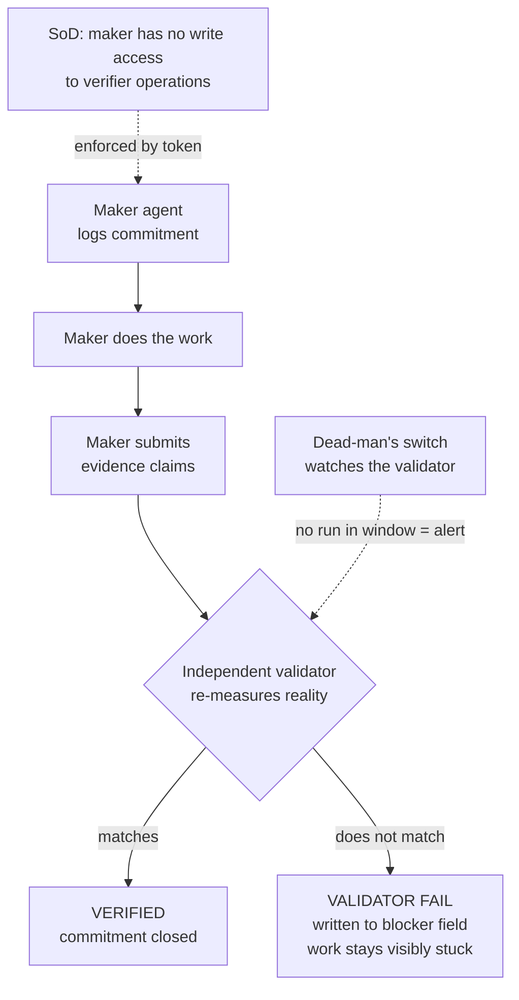

# Attestor

> An accountability and verification layer for AI agent fleets — so that **"done" means proven, not claimed.**

> [!NOTE]
> **Reference implementation, not a maintained product.** This is a clean extraction of a pattern that has run a live small-business agent fleet in production. It is published to be read, forked, and adapted — not supported. Licensed under Apache-2.0.

---

## The problem

Agents fabricate. Not maliciously — they pattern-match to what a *successful completion* looks like and emit that output, whether or not the underlying work actually happened. They also forget between sessions, and an anonymous subagent spawned and discarded has no reputation to protect.

You cannot prompt this away. Telling an agent "don't fabricate" changes nothing, because the agent believes it isn't.

**Fabrication is an architecture problem, not a behavior problem.** The fix is not a better prompt — it is tooling that makes fabrication *detectable* and self-reported completion *unnecessary to trust.*

---

## What this is

A small, framework-agnostic enforcement layer that sits around any agent (or fleet of agents) and makes their work **accountable** and **independently verifiable**. Built from six primitives drawn directly from financial-controls practice:

| Primitive | Controls analogue | What it enforces |
|-----------|------------------|-----------------|
| **Commitments ledger** | Pre-authorization | Work is logged *before* it starts. No open commitment = the work hasn't started. |
| **Evidence-required completion** | Evidence-based assurance | Closing a commitment requires verifiable proof — file paths, HTTP responses, row counts. Words are not evidence. |
| **Independent validator** | Substantive testing | A separate process **re-measures reality** after an agent marks work done. It does not trust the agent's pasted evidence — it hits the endpoint, counts the rows, stats the file itself. |
| **Maker-checker gate** | Four-eyes / dual control | The agent that *did* the work cannot be the one that *verifies* it. Enforced by a verifier token never present in the maker's environment. |
| **Segregation of duties** | Least privilege / SoD | The audited party cannot write to the ledger it is judged against. Enforced at the permission layer — not the prompt. |
| **Validator dead-man's switch** | Monitor the monitor | If the validator stops reporting within its expected window, that is an alert. Silence is not success. |

---

## How it works



The load-bearing idea: **claimed evidence and verified evidence are separately sourced, and only the checker's independent measurement counts.** A fabricating agent can paste a plausible `200 OK` as easily as it fabricates the work — so the checker never reads the agent's transcript. It measures the world.

---

## Quickstart

```bash
git clone https://github.com/smallbusinessrisk/attestor
cd attestor
pip install -e .

# Set the verifier token — only in the validator's environment, never in maker context
export ATTESTOR_VERIFIER_TOKEN=$(python3 -c "import secrets; print(secrets.token_hex(32))")

# Run the fabrication demo — watch an agent get caught in real time
python examples/fabrication_demo/run_demo.py
```

---

## Usage

### Maker side (any agent doing work)

```python
from attestor.adapters.store.sqlite import SQLiteLedger
from attestor.core.maker import MakerAPI
from attestor.core.evidence import EvidenceClaim

ledger = SQLiteLedger("attestor.db")
maker = MakerAPI(ledger=ledger, maker_id="my-agent")

# 1. Log commitment before starting — no commitment = not started
commitment = maker.commit("Deploy updated server.js to production", due_hours=1)
maker.start(commitment.id)

# 2. Do the actual work
# ... deploy the file ...

# 3. Submit evidence claims for the validator to independently verify
maker.submit_evidence(commitment.id, [
    EvidenceClaim(
        kind="http_status",
        description="/health returns 200 after deploy",
        url="https://myserver.example.com/health",
        expected_status=200,
    ),
    EvidenceClaim(
        kind="file_exists",
        description="server.js updated on disk",
        path="/var/www/app/server.js",
        min_bytes=1000,
    ),
])
# Commitment stays in_progress until the validator independently confirms
```

### Checker side (validator process only)

```python
import os
from attestor.adapters.store.sqlite import SQLiteLedger
from attestor.adapters.notifier.discord import DiscordNotifier
from attestor.core.checker import CheckerAPI
from attestor.core.watchdog import Watchdog

ledger = SQLiteLedger("attestor.db")
notifier = DiscordNotifier()  # or StdoutNotifier()

# CheckerAPI instantiation fails without ATTESTOR_VERIFIER_TOKEN — SoD enforced
checker = CheckerAPI(
    ledger=ledger,
    verifier_id="validator-process",
    token=os.environ["ATTESTOR_VERIFIER_TOKEN"],
    notifier=notifier,
)

summary = checker.run()   # Re-measures all pending commitments
Watchdog().heartbeat()    # Dead-man's switch: record that the validator ran

print(summary)  # {"passed": [...], "failed": [...], "skipped": [...]}
```

---

## Repo layout

```
attestor/
  core/
    ledger.py       # Commitment dataclass + LedgerAdapter interface
    evidence.py     # EvidenceClaim + EvidenceResult contracts
    maker.py        # MakerAPI — commit, start, submit_evidence
    checker.py      # CheckerAPI — verify, reject, run (verifier token required)
    watchdog.py     # Dead-man's switch
  adapters/
    store/
      sqlite.py     # SQLite reference ledger (zero dependencies)
    notifier/
      stdout.py     # Default: print to terminal
      discord.py    # Discord webhook (example adapter)
    checks/
      file_check.py    # File exists + min size
      http_check.py    # HTTP status code
      db_check.py      # SQLite row count
      command_check.py # Command exit code
  examples/
    fabrication_demo/
      run_demo.py   # End-to-end: fabricating agent caught by validator
```

---

## Who this is for

Small teams and solo operators running a **persistent, non-coding operations fleet** — finance, content, ops, analytics, research agents that run on a clock and report their own completion — who need to actually trust what those agents say they did.

Zero runtime dependencies. Requires Python 3.11+. Works with any agent framework or none.

---

## Who this is *not* for (honest related work)

- **Coding agents in a CI/git pipeline** → [Agentic OS](https://github.com/KbWen/agentic-os) does plan→build→review→test→ship with evidence gates in git hooks and CI. Attestor is not coding-specific and does not assume a git workflow.
- **Enterprise runtime governance** → Microsoft's [Agent Governance Toolkit](https://github.com/microsoft/agent-governance-toolkit) offers a policy engine, compliance grading (EU AI Act / HIPAA / SOC 2), and cryptographic signing at enterprise scale on Azure. Attestor is self-hostable, small, and has no cloud dependency.

**What Attestor does that neither names as a first-class primitive: maker-checker and segregation of duties.** Those are banking controls. Applying them directly to agent verification — the maker cannot be the checker, the audited cannot write the audit log — is the distinguishing lens. It comes from having run internal audit, not from reaching for the concept intuitively.

---

## Design principles

1. Fabrication is detectable, not preventable — build the tooling, not the prompt.
2. Claimed evidence is not verified evidence. Only independent re-measurement counts.
3. The audited party cannot write to its own audit log.
4. Named agents accumulate track records; anonymous subagents cannot be held to account.
5. Monitor the monitor. A silent validator is the most dangerous state in the system.

---

## Status

Reference implementation. Not actively maintained. No warranty. Fork freely under Apache-2.0.

---

*Extracted from the Trust Stack operating model by Scott Lindsay, Small Business Risk Inc., Russell, Ontario. 2026.*

*"You don't need luck — you need knowledge."*
